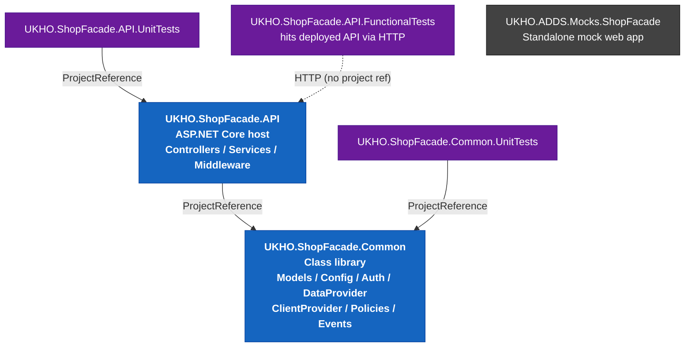
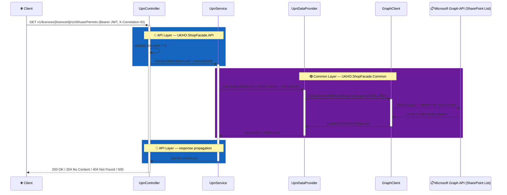
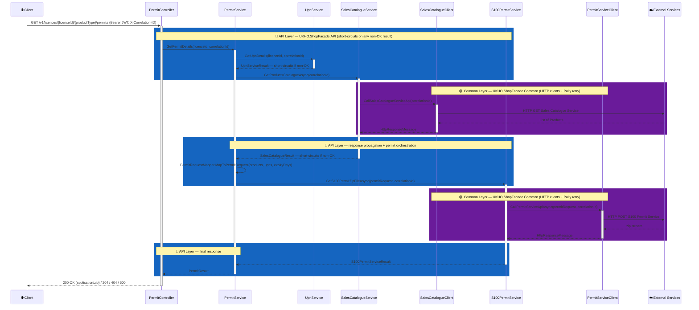
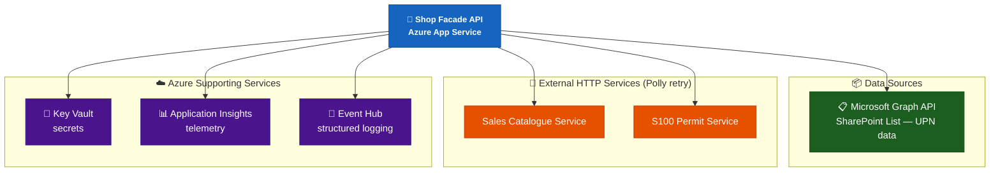
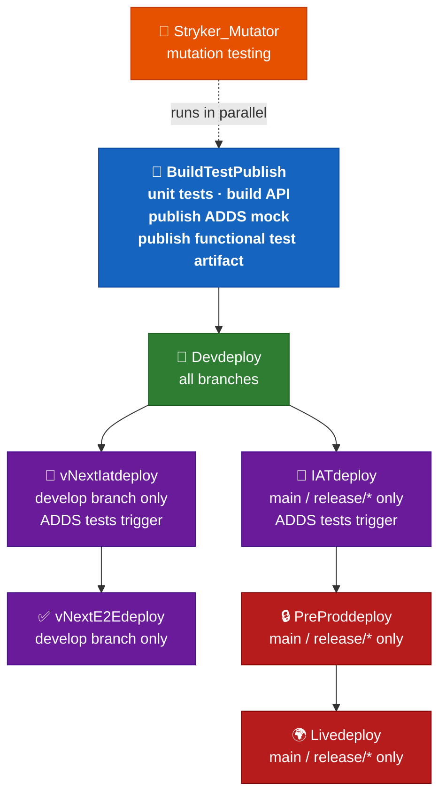
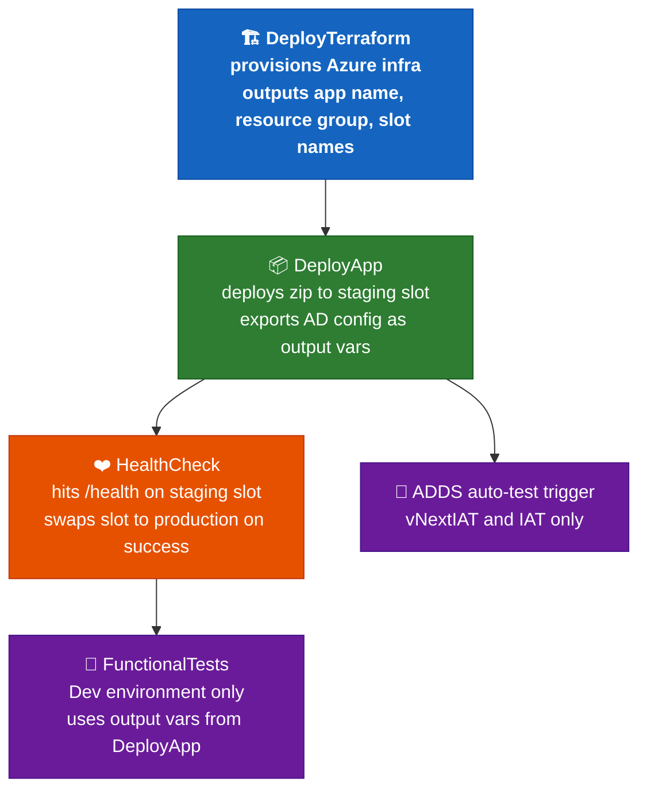

# Copilot Instructions for Shop-Facade

## Build & Test Commands

```bash
# Build the solution
dotnet build ShopFacade.sln

# Run all unit tests
dotnet test --settings test.runsettings

# Run tests for a specific project
dotnet test tests/UKHO.ShopFacade.API.UnitTests/UKHO.ShopFacade.API.UnitTests.csproj
dotnet test tests/UKHO.ShopFacade.Common.UnitTests/UKHO.ShopFacade.Common.UnitTests.csproj

# Run a single test by name
dotnet test tests/UKHO.ShopFacade.API.UnitTests/UKHO.ShopFacade.API.UnitTests.csproj --filter "FullyQualifiedName~WhenLicenceIdIsInvalid"

# Run Stryker mutation tests (from within the test project directory)
dotnet stryker --test-project tests/UKHO.ShopFacade.API.UnitTests/UKHO.ShopFacade.API.UnitTests.csproj
```

Local configuration overrides go in `src/UKHO.ShopFacade.API/appsettings.local.overrides.json` (loaded in `DEBUG` builds only, gitignored).

---

## Architecture

Shop-Facade is an ASP.NET Core 9.0 API that acts as a façade over multiple downstream services, exposing two endpoints:

- **GET `v1/licences/{licenceId}/s100/userPermits`** — retrieves S-100 User Permit Numbers (UPNs) for a licence by querying a **Microsoft Graph / SharePoint list**.
- **GET `/v1/licences/{licenceId}/{productType}/permits`** — assembles and returns a zip of S-100 permit files by orchestrating three downstream calls in sequence: UPN lookup → Sales Catalogue Service → S100 Permit Service. `{productType}` is currently always `s100` in practice.

### Project layout

| Project | Role |
|---|---|
| `src/UKHO.ShopFacade.API` | Web API host — controllers, services, middleware, filters, DI wiring |
| `src/UKHO.ShopFacade.Common` | Shared library — models, config classes, authentication, data providers, HTTP clients, Polly policies |
| `src/UKHO.ADDS.Mocks.ShopFacade` | Mock service used in ADDS integration/functional test environments |
| `tests/UKHO.ShopFacade.API.UnitTests` | NUnit unit tests for the API project |
| `tests/UKHO.ShopFacade.Common.UnitTests` | NUnit unit tests for the Common project |
| `tests/UKHO.ShopFacade.API.FunctionalTests` | End-to-end functional tests run against deployed environments |

### Project dependency diagram



### Request flow — UPN endpoint



### Request flow — Permit endpoint



### Runtime dependency diagram



---

## SharePoint UPN Schema

UPN data is stored in a SharePoint list queried via Microsoft Graph. The list is identified by `GraphApiConfiguration:SiteId` and `GraphApiConfiguration:ListId`. The `Title` field holds the licence ID (used as the OData filter key).

Each list item can hold up to **5 UPN slots**. The fields selected are:

| Field name           | Meaning                     |
|----------------------|-----------------------------|
| `ECDIS_UPN1_Title`   | Display title for UPN slot 1 |
| `ECDIS_UPN_1`        | UPN value for slot 1         |
| `ECDIS_UPN2_Title`   | Display title for UPN slot 2 |
| `ECDIS_UPN_2`        | UPN value for slot 2         |
| `ECDIS_UPN3_Title`   | Display title for UPN slot 3 |
| `ECDIS_UPN_3`        | UPN value for slot 3         |
| `ECDIS_UPN4_Title`   | Display title for UPN slot 4 |
| `ECDIS_UPN_4`        | UPN value for slot 4         |
| `ECDIS_UPN5_Title`   | Display title for UPN slot 5 |
| `ECDIS_UPN_5`        | UPN value for slot 5         |

Rules applied by `UpnDataProvider`:
- If `Value.Count == 0` → `NotFound` (licence not in SharePoint).
- If items exist but **no field key contains `"UPN"`** → `NoContent` (licence found, but no UPNs assigned).
- UPN slots 2–5 are only included in the API response when **both** `Title` and `Upn` are non-empty.
- Field values are read from `ListItem.Fields.AdditionalData` (Microsoft Graph SDK `AdditionalData` dictionary).

The OData expand string (defined in `UpnDataProviderConstants.ExpandFields`) explicitly selects only those 10 fields plus the filter uses `fields/Title eq '{licenceId}'`.

---

## Functional Test Setup

Functional tests (`tests/UKHO.ShopFacade.API.FunctionalTests`) run against a **live deployed environment** — they are not in-process and do not mock anything. They require real Azure AD credentials.

### Configuration

Fill in `tests/UKHO.ShopFacade.API.FunctionalTests/appsettings.json` before running locally:

```json
{
  "ShopFacadeConfiguration": {
    "BaseUrl": "<deployed API base URL>",
    "UpnEndpoint": "v1/licences/licenceId/s100/userPermits",
    "PermitEndpoint": "v1/licences/licenceId/s100/permits"
  },
  "AzureADConfiguration": {
    "MicrosoftOnlineLoginUrl": "https://login.microsoftonline.com/",
    "TenantId": "<tenant GUID>",
    "ClientId": "<API app registration client ID>",
    "AutoTestClientId": "<test client with role>",
    "ClientSecret": "<test client secret with role>",
    "AutoTestClientIdNoRole": "<test client without role>",
    "ClientSecretNoRole": "<test client secret without role>",
    "IsRunningOnLocalMachine": true
  }
}
```

- Set `IsRunningOnLocalMachine: true` to trigger **interactive browser auth** (`AcquireTokenInteractive`) instead of client-credentials flow.
- In CI, `IsRunningOnLocalMachine` is `false` and credentials are injected via Azure DevOps variable groups using `FileTransform` on `appsettings.json`.

### Auth flow

```
AuthTokenProvider.GetAzureADTokenAsync(noRole: bool)
  │
  ├─ noRole=false → ConfidentialClientApplication with AutoTestClientId + ClientSecret
  │                  scope: {ClientId}/.default
  │
  └─ noRole=true  → ConfidentialClientApplication with AutoTestClientIdNoRole + ClientSecretNoRole
                     (this client has no app roles → tests 403 Forbidden behaviour)
```

### Test fixture base class

All test classes extend `TestFixtureBase`, which builds a `ServiceProvider` from `appsettings.json` via `TestServiceConfiguration.ConfigureServices()`. Endpoint helper classes (`UpnEndpoint`, `PermitEndpoint`) use **RestSharp** to call the API and are also `TestFixtureBase` subclasses.

### Well-known test licence IDs

The functional tests use fixed licence IDs that map to specific SharePoint/mock data states:

| licenceId | Expected behaviour |
|---|---|
| `1` | Valid licence with UPNs → 200 OK |
| `2` | Triggers 500 Internal Server Error (SharePoint list down / error state) |
| `3` | Licence does not exist → 404 Not Found |
| `4` | Licence exists but has no UPNs → 204 No Content |

---

## Deployment Pipeline

The pipeline is defined in `azure-pipelines.yml` and uses templates under `Deployment/templates/`.

### Pipeline stages



### Per-environment deploy jobs (inside each deploy stage)



### Key pipeline details

- **Terraform state & secrets** are sourced from Azure DevOps variable groups named `Shop-Facade-<Env>`, `Shop-Facade-<Env>-TF`, and (non-PreProd/Live) `Shop-Facade-<Env>-KV`.
- **Assembly version** is stamped by `Apply-AssemblyVersionAndDefaults.ps1` before build using the build number (`1.0.<date>.<counter>`).
- The **ADDS mock service** (`UKHO.ADDS.Mocks.ShopFacade`) is built and deployed separately alongside the main API in each environment.
- NuGet restore uses `BuildNuget.config` (custom feed configuration).
- Target SDK: **.NET 9.0**.

---

## Key Conventions

### Result pattern
All service/data-provider return values extend `Result<T>` via a typed subclass (e.g., `UpnServiceResult`, `PermitResult`, `ServiceResponseResult<T>`). Each subclass has static factory methods:
```csharp
UpnServiceResult.Success(value)
UpnServiceResult.NoContent()
UpnServiceResult.NotFound(errorResponse)
UpnServiceResult.InternalServerError()
```
Controllers switch on `.StatusCode` (an `HttpStatusCode`) and return the appropriate `IActionResult`. Services propagate `ErrorResponse` objects from lower layers.

### EventIds & logging
Every log statement must use a named `EventIds` enum value (range starts at `950001`) converted via `.ToEventId()`:
```csharp
_logger.LogInformation(EventIds.GetUPNsCallStarted.ToEventId(), ErrorDetails.GetUPNsCallStartedMessage);
```
When adding new log calls, add a new entry to `src/UKHO.ShopFacade.Common/Events/EventIds.cs` with the next available integer and an XML doc comment. Unit tests assert specific event IDs, log levels, and message strings.

### Correlation ID
All service methods accept a `string correlationId` parameter passed from `BaseController.GetCorrelationId()`, which reads the `X-Correlation-ID` request header. Always thread it through every layer.

### Authorization
Two role-based policies defined in `ShopFacadeConstants`:
- `ShopFacadeUpnPolicy` (`"UpnReader"`) — for the UPN endpoint
- `ShopFacadePermitPolicy` (`"PermitReader"`) — for the Permit endpoint

Both require Azure AD JWT Bearer auth (`AzureAdScheme`).

### Testing conventions
- **Framework**: NUnit 4 + FakeItEasy
- Fakes are created with `A.Fake<T>()` and verified with `A.CallTo(_fakeLogger).Where(...)`.
- Logger calls are verified by inspecting `LogLevel`, `EventId`, and the `{OriginalFormat}` key in the structured log arguments — see existing controller tests for the exact pattern.
- Test methods follow the naming pattern: `When<Condition>_Then<ExpectedOutcome>`.
- `[TestFixture]` / `[SetUp]` / `[Test]` / `[TestCase(...)]` attributes are used throughout.
- Code coverage must stay at or above **90%** (enforced in CI).

### Configuration
All configuration classes live in `src/UKHO.ShopFacade.Common/Configuration/`. Secrets are sourced from **Azure Key Vault** (URI configured via `KeyVaultSettings:ServiceUri`); runtime config uses `IOptions<T>` binding.

### HTTP clients & retry
External HTTP clients (`SalesCatalogueClient`, `PermitServiceClient`) are registered with `AddHttpClient<>` and decorated with a **Polly retry policy** via `RetryPolicyProvider`. Retry count and duration come from the `RetryPolicyConfiguration` config section.
